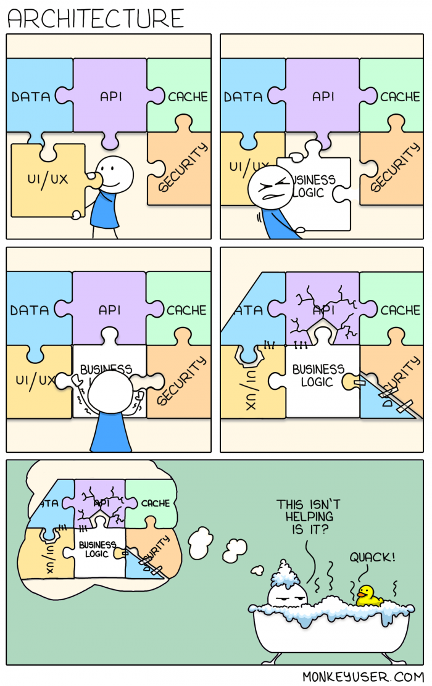
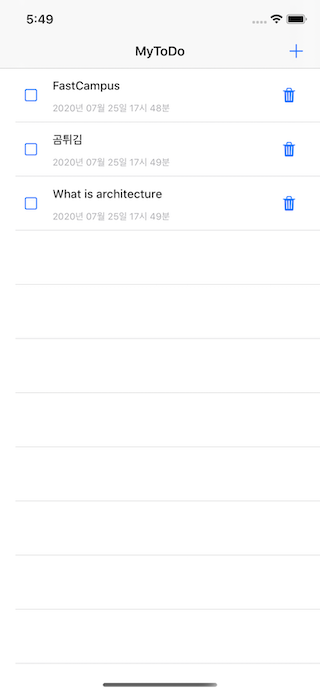
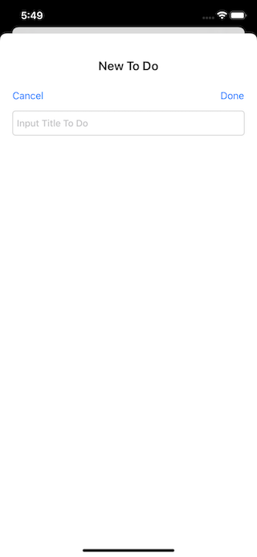

# 아키텍쳐가 뭔데

#### 예제 코드 가이드

- [여기](https://github1s.com/iamchiwon/whatisarchitecture)에서 코드를 편하게 보세요.
- 커밋 단위로 개발이 진행되는 과정을 살펴보세요.
- 의도적으로 외부 라이브러리를 사용하지 않았습니다.
- domain 레이어 하위 레이어들에서 UIKit이나 UIApplication에 의존하지 않는 부분을 주목해 보세요.
- 프로토콜과 구현이 분리되어 각각 어디에 코드가 있는지 살펴보세요.

###### 20200805 fastcampus 특강

## Agenda

1. 아키텍쳐가 뭐냐?
   - 소문: 어디서 들어본 얘기
2. 잘 구성된 프로그램이란?
   - 좋은 프로그램의 기준
3. 프로그램 조망하기
   - 컴퓨터의 구성 및 동작
   - 프로그램의 구성 및 동작
4. 좋은 프로그램을 만드는 방법
   - 이론적 원칙
   - 모범사례
5. 연습
   - MyToDo 만들기  
      
   - 요구사항 > 설계 (책임과 역할) > 구현
   - TDD > MVC > MVVM
